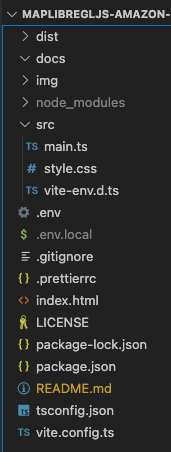

# maplibregljs-amazon-location-service-place-indexes-starter


Easily start geocoding with MapLibre GL JS and Amazon Location Service.  
- [MapLibre GL JS v3.3.1](https://maplibre.org)  
- [Amazon Location Service](https://aws.amazon.com/location)  
- node v20.6.1
- npm v9.8.1

<br>

## blog

[Building an Address Search Function with Amazon Location SDK and API key function](https://dev.to/aws-heroes/building-an-address-search-function-with-amazon-location-sdk-and-api-key-function-3614)

<br>

## Usage



<br>

Create Amazon Location Service "map", "API key(map)", "geocoding" and "API key(geocoding)"

- [API key creation (map)](https://memo.dayjournal.dev/memo/amazon-location-service-004)  
- [API key creation (geocoding)](https://memo.dayjournal.dev/memo/amazon-location-service-005)  

<br>

Set "region", "API key(map)", "map name", "API key(geocoding)" and "geocoding name" in env file
```env
VITE_REGION = xxxxx
VITE_MAP_API_KEY = v1.public.xxxxx
VITE_MAP_NAME = xxxxx
VITE_PLACE_API_KEY = v1.public.xxxxx
VITE_PLACE_NAME = xxxxx
```

<br>

Install package
```bash
npm install
```

<br>

build
```bash
npm run build
```

<br>

dev
```bash
npm run dev
```

---

<br>
<br>


<br>

## License
MIT

Copyright (c) 2023 MapLibre User Group Japan

<br>

---

<br>

### Japanese

<br>

# MapLibreGLJS & Amazon Location Service & ジオコーディング スターター


MapLibre GL JSとAmazon Location Serviceでジオコーディングを手軽に始める
- [MapLibre GL JS v3.3.1](https://maplibre.org)  
- [Amazon Location Service](https://aws.amazon.com/location)  
- node v20.6.1
- npm v9.8.1

<br>

## blog

[Amazon Location SDKとAPIキーで住所検索機能を構築してみた](https://memo.dayjournal.dev/memo/try-104)

<br>

##  使用方法


<br>

Amazon Location Serviceのマップ・APIキー(マップ)・ジオコーディング・APIキー(ジオコーディング)を作成

- [APIキー作成(マップ)](https://memo.dayjournal.dev/memo/amazon-location-service-004)  
- [APIキー作成(ジオコーディング)](https://memo.dayjournal.dev/memo/amazon-location-service-005)  

<br>

リージョン・APIキー(マップ)・マップ名・APIキー(ジオコーディング)・ジオコーディング名をenvファイルに設定
```env
VITE_REGION = xxxxx
VITE_MAP_API_KEY = v1.public.xxxxx
VITE_MAP_NAME = xxxxx
VITE_PLACE_API_KEY = v1.public.xxxxx
VITE_PLACE_NAME = xxxxx
```

<br>

パッケージインストール

```bash
npm install
```

<br>

ビルド

```bash
npm run build
```

<br>

開発

```bash
npm run dev
```

<br>
<br>


<br>

## ライセンス
MIT

Copyright (c) 2023 MapLibre User Group Japan

<br>
